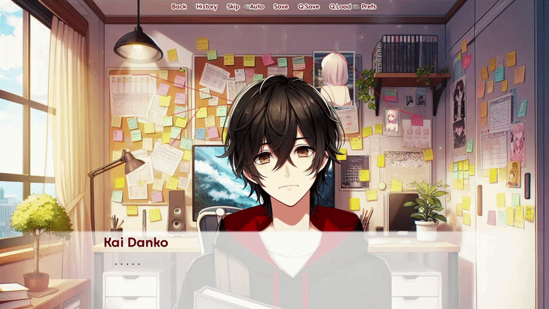
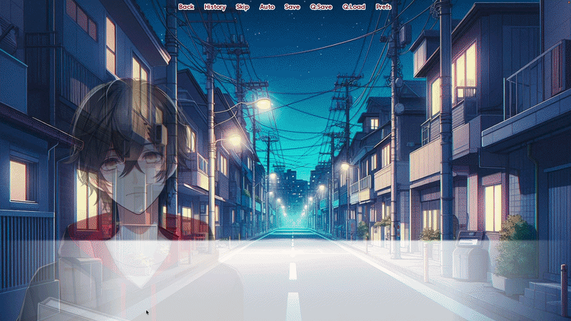

# Rose-Tinted Lies

A psychological thriller visual novel that explores societal themes of obsession, manipulation, and the duality of human nature.

---

## About
In the growing landscape of visual novels, "Rose-Tinted Lies" is a psychological thriller that explores societal themes of obsession, manipulation, and the duality of human nature. The game follows Kai Danko, a seemingly normal high school transfer student whose facade hides dark intentions as he develops an interest in his classmate, Bela Camelia. What begins as admiration quickly escalates, as Kai infiltrates Bela's life under the disguise of friendship, setting off a series of actions that may lead to tragic consequences.

The way the story pans out is determined through player choices that lead to branching narratives, designed to ensure a fun and engaging experience for our audience.

---

## Title & Characters
When first seeing the name "Rose-Tinted Lies," it may immediately hint at a basic romance game but as people start playing it, the realization kicks in that there's a much darker 
undertone. The term "rose-tinted" refers to viewing situations with unjustified optimism, while "lies" directly addresses the deception through the progression of the narrative.

Character names were chosen with specific symbolic significance:
- **Kai Danko** — Can be restructured as "Kaidan Ko," which is Japanese for "child of a mysterious tale," foreshadowing the character's vicious actions.
- **Bela Camelia** — "Bela" means "white" in Czech and Russian while Camelia is derived from camellia, referring to the type of flowers. A white camellia flower symbolizes admiration, innocence, and also death, another hint at future events.

---

## Visuals & Sound
The game's visual aesthetic was developed through a combination of AI-generated assets and image editing/post-processing. Character sprites were generated using Microsoft Designer and edited using Paint.NET to depict various emotions, the act of speaking, etc.

A decision was made for the color palette to evolve throughout the game, beginning with warm and bright tones that gradually gave way to cool, darker, more ominous hues, providing environmental cues to enhance the experience.

The backing tracks were sourced from FulminisIctus' Visual Novel Audio Pack. Additional sound effects were pulled from Pocketsound and TK'S FREE SOUND FX.

---

## Development
The game was developed using Ren'Py, a free open source visual novel engine. Text effects were implemented using Wattson's Kinetic Text Tags. The GUI icons, placements, and colors were edited and configured to match the game's general theme.

Quick Time Events (QTEs) were purposefully inserted during pivotal moments, such as scenes leading to the arrest or murder of certain characters, disrupting the conventional visual novel structure and directly involving players at significant plot points.

---

## Endings
The branching narrative system results in three different outcomes:
- **Arrest Ending**
- **Stalking Ending**
- **Murder Ending**

---

## Target Audience
Content is aimed at players aged 16 and above due to mature themes of stalking, violence, and psychological tension.

---

## Gameplay Examples

### Main Menu

### Choices

### Demeanor Shift

### QTE Scene

## Credits
Developed by Ira Cheng and Tse Him Wu

Chinese University of Hong Kong

CURE 3006: Video Game and Play Culture 